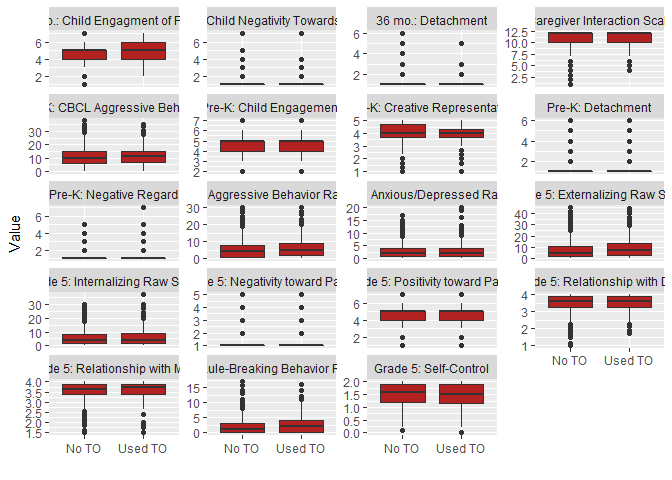
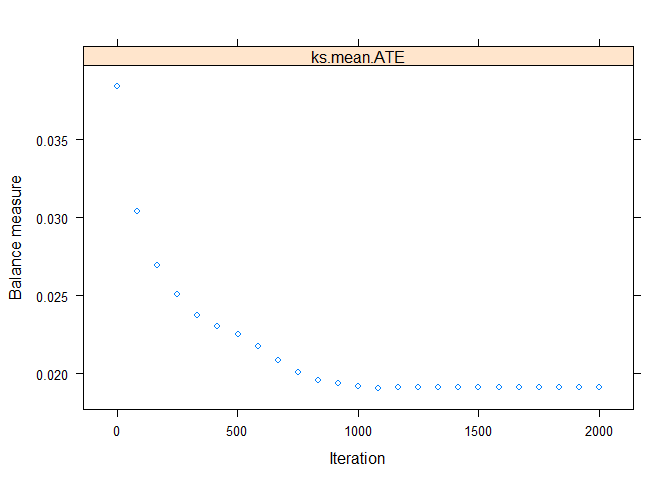
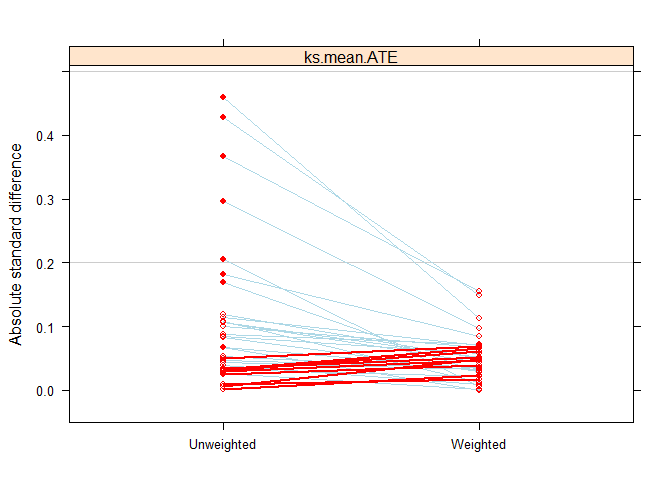

headstart analysis
================
Drayton et al.
18 September, 2019

Start by loading relevant packages and reading in data.

A few variable recodes.

  - Log income ratio
  - Dummy variable for “Uses Physical Violence”
  - Reverse code “Relationship with Father”
  - Create labeled factors, as necessary

Also, filter to cases with grade 5 time out data only.

``` r
tbl <- tbl %>%
  mutate(INCOMERATIO = log(POVRATIO+.01),
         PHYS        = as.numeric(B3P_DTAC == 5),
         rev_C5_FREL = 4 - C5_FREL) %>% 
  mutate(TEENMOM   = factor(TEENMOM, levels = 0:1, labels = c("Not Teen Mother", "Teen Mother")),
         P2V2_ANY  = factor(P2V2_ANY, levels = 0:1, labels = c("No Services", "Received Services")),
         B5P_SUBS  = factor(B5P_SUBS, levels = 0:1, labels = c("No SA", "Substance Abuse")),
         RACE      = factor(RACE, levels = 1:4, labels = c("White", "Af Am", "Hispanic", "Other")),
         B3P_DTO   = factor(B3P_DTO, levels = 0:1, labels = c("No TO", "Used TO"))) %>% 
  mutate(B3P_DPRV  = factor(B3P_DPRV, levels = 0:1, labels = c("No Prev", "Prevent/Distract")),
         B3P_DRMV = factor(B3P_DRMV, levels = 0:1, labels = c("No Removal", "Discipline: Remove Child/Object")),
         B3P_DRST = factor(B3P_DRST, levels = 0:1, labels = c("No Restraint", "Discipline: Restrain")),
         B3P_DSHO = factor(B3P_DSHO, levels = 0:1, labels = c("No Shouting", "Discipline: Shout")),
         B3P_DTHR = factor(B3P_DTHR, levels = 0:1, labels = c("No Threaten", "Discipline: Threaten")),
         B3P_DTLK = factor(B3P_DTLK, levels = 0:1, labels = c("No Explanation", "Talk/Explain")),
         B3P_DWRN = factor(B3P_DWRN, levels = 0:1, labels = c("No Non-Verbal Warning", "Discipline: Warn/Remind (Non-Verbal)")),
         B3P_DWRV = factor(B3P_DWRV, levels = 0:1, labels = c("No Verbal Warning", "Discipline: Warn/Remind (Verbal)"))) %>%
  filter(B5P_DATA==1 & !is.na(B3P_DTO))
```

Declare variables and their role.

``` r
dvs_36m  <- c("B3V3CENG",   # Child Engagment of Parent (3-bag)
              "B3V3CNEG",   # Child Negativity Towards Parent (3-bag),
              "B3V3PDET"    # Detachment (3-bag)
              )

dvs_prek <- c("T4CORCRE",   # Creative Representation (Pre-K)
              "B4CBCLAG",   # CBCL Aggressive Behavior
              "T4CISDET",   # Arnett Caregiver Interaction Scale detachment
              "B4PDPDET",   # Detachment (Play-doh)
              "BPDPNET",    # Negative Regard (Play-doh)
              "B4PDCENG"    # Child Engagement (Play-doh)
              )

dvs_g5 <- c("B5VCPOS",    # Positivity toward Parent
         "B5VCNEG",       # Negativity toward Parent
         "B5CB_AXR",      # Anxious/Depressed Raw Score
         "B5CB_RBR",      # Rule-Breaking Behavior Raw Score
         "B5CB_AGR",      # Aggressive Behavior Raw Score
         "B5CB_INR",      # Internalizing Raw Score
         "B5CB_EXR",      # Externalizing Raw Score
         "C5_FREL",       # Relationship with Dad
         "C5_MREL",       # Relationship with Mom
         "T5_SSRS_SC"     # Self-Control
         )

controls <- c("TEENMOM",     # Teen Mother",
              "B5P_EDUC",    # Mother Education",
              "P2V2_ANY",    # Receives Services",
              "B3P_CDSF",    # Depression (36 months)",
              "B5P_SUBS",    # Substance Abuse",
              "B5P_ALCH",    # Level of Alcohol Abuse",
              "INCOMERATIO", # "Income/Poverty Ratio (Log)",
              "RACE",        # Primary caregiver's race,
              "B3P_DPRV",    # Discipline: Prevent/Distract
              "B3P_DRMV",    # Discipline: Remove Child/Object
              "B3P_DRST",    # Discipline: Restrain
              "B3P_DSHO",    # Discipline: Shout
              "B3P_DTHR",    # Discipline: Threaten
              "B3P_DTLK",    # Discipline: Talk/Explain
              "B3P_DWRN",    # Discipline: Warn/Remind (Non-Verbal)
              "B3P_DWRV",    # Discipline: Warn/Remind (Verbal)
              "B3P_DPH1"     # Discipline: Physical Punishment
              )

tx <- "B3P_DTO" 
```

The discipline variables are based on the following description from the
codebook:

> Discipline Strategies–measures the parent’s strategies for handling
> four different potential conflict situations with the child: 1) the
> child keeps playing with breakable things; 2) the child refuses to
> eat; 3) the child throws a temper tantrum in a public place 4) the
> child hits the parent in anger (\# 4 is only available at 36-Months).
> Parents provided open-ended answers to how they would respond to each
> of the four situations, and these responses were classified into the
> types of discipline strategies, which were coded as binary variables.
> A parent received a “1” for each strategy that was ever mentioned.

The following are sample responses for each type of discipline:

  - Prevent/Distract: If parent responded “put things out of
    reach/distract child with activity/make new food/play a game to get
    him/her to eat/ give child food/ distract child/give child something
    to play with/hold child/hold child’s hand until child is calm” in
    any one of the 3 or 4 scenarios then BnP\_DPRV is set equal to 1.
  - Threaten: If parent responded “leave and expect child to follow/tell
    child parent will punish him/her at home” in any one of the 3 or 4
    scenarios then BnP\_DTHR is set equal to 1.
  - Shout: If parent responded “shout at child/punish child
    verbally/yell at child” in any one of the 3 or 4 scenarios then
    BnP\_DSHO is set equal to 1.
  - Talk/Explain: If parent responded “tell child NO and explain why/ask
    child to put object down/explain importance of eating/continue to
    try to get child to eat, but don’t force child/ talk to child” in
    any one of the 3 or 4 scenarios then BnP\_DTLK is set equal to 1.
  - Remove Child/Object: If parent responded “take child away/stop
    feeding child; child is not hungry/take food away/pick up child and
    leave” in any one of the 3 or 4 scenarios then BnP\_DRMV is set
    equal to 1.
  - Restrain: If parent responded to restrain child in any one of the 4
    scenarios then B3P\_DRST is set equal to 1.
  - Time Out: If parent responded “give child time out or quiet
    time/child must sit in corner” in any one of the 4 scenarios then
    BnP\_DTO is set equal to 1.
  - Shout: If parent responded “shout at child/punish child
    verbally/yell at child” in any one of the 3 or 4 scenarios then
    BnP\_DSHO is set equal to 1.
  - Warn/Remind (Verbal): If parent responded “threaten to take away
    treats/threaten time out when get home” in any one of the 4
    scenarios then B3P\_DWRV is set equal to 1.
  - Warn/Remind (Non-Verbal): If parent responded “Tell child no and
    expect child to obey/ count/the”look“/stare at child” in any one of
    the 4 scenarios then B3P\_DWRN is set equal to 1.

Create a function to create cleaner tables.

``` r
var_labs <- function(tbl, var){
  
  var <- sym(var)
  
  tbl %>%
    mutate(!!var := case_when(
      !!var == "B3V3CENG"     ~ "36 mo.: Child Engagment of Parent",
      !!var == "B3V3CNEG"     ~ "36 mo.: Child Negativity Towards Parent",
      !!var == "B3V3PDET"     ~ "36 mo.: Detachment",
      !!var == "T4CORCRE"     ~ "Pre-K: Creative Representation",
      !!var == "B4CBCLAG"     ~ "Pre-K: CBCL Aggressive Behavior",
      !!var == "T4CISDET"     ~ "Pre-K: Arnett Caregiver Interaction Scale detachment",
      !!var == "B4PDPDET"     ~ "Pre-K: Detachment",
      !!var == "BPDPNET"      ~ "Pre-K: Negative Regard",
      !!var == "B4PDCENG"     ~ "Pre-K: Child Engagement",
      !!var == "B5VCPOS"      ~ "Grade 5: Positivity toward Parent",
      !!var == "B5VCNEG"      ~ "Grade 5: Negativity toward Parent",
      !!var == "B5CB_AXR"     ~ "Grade 5: Anxious/Depressed Raw Score",
      !!var == "B3P_WARM"     ~ "Grade 5: HOMES Parental Warmth",
      !!var == "B5CB_RBR"     ~ "Grade 5: Rule-Breaking Behavior Raw Score",
      !!var == "B5CB_AGR"     ~ "Grade 5: Aggressive Behavior Raw Score",
      !!var == "B5CB_INR"     ~ "Grade 5: Internalizing Raw Score",
      !!var == "B5CB_EXR"     ~ "Grade 5: Externalizing Raw Score",
      !!var == "C5_DELB"      ~ "Grade 5: Delinquent Behaviors",
      !!var == "C5_FREL"      ~ "Grade 5: Relationship with Dad",
      !!var == "C5_MREL"      ~ "Grade 5: Relationship with Mom",
      !!var == "T5_SSRS_SC"   ~ "Grade 5: Self-Control",
      !!var == "TEENMOM"      ~ "Teen Mother (Baseline Survey)",
      !!var == "B5P_EDUC"     ~ "Grade 5: Mother Education",
      !!var == "P2V2_ANY"     ~ "Receives Services (Any Study Year)",
      !!var == "B3P_CDSF"     ~ "36 mo.: Depression",
      !!var == "B5P_SUBS"     ~ "Grade 5: Substance Abuse",
      !!var == "B5P_ALCH"     ~ "Grade 5: Level of Alcohol Abuse",
      !!var == "INCOMERATIO"  ~ "Income/Poverty Ratio (Log) (Baseline Survey)",
      !!var == "RACE"         ~ "Primary Caregiver's Race (Baseline Survey)",
      !!var == "B3P_DPRV"     ~ "36 mo.: Discipline - Prevent/Distract",
      !!var == "B3P_DRMV"     ~ "36 mo.: Discipline - Remove Child/Object",
      !!var == "B3P_DRST"     ~ "36 mo.: Discipline - Restrain",
      !!var == "B3P_DSHO"     ~ "36 mo.: Discipline - Shout",
      !!var == "B3P_DTHR"     ~ "36 mo.: Discipline - Threaten",
      !!var == "B3P_DTLK"     ~ "36 mo.: Discipline - Talk/Explain",
      !!var == "B3P_DWRN"     ~ "36 mo.: Discipline - Warn/Remind (Non-Verbal)",
      !!var == "B3P_DWRV"     ~ "36 mo.: Discipline - Warn/Remind (Verbal)",
      !!var == "B3P_DPH1"     ~ "36 mo.: Discipline - Physical Punishment",
      !!var == "B3P_DTOUsed TO"            ~ "Used Time-Out",
      !!var == "TEENMOMTeen Mother"        ~ "Teen Mother",
      !!var == "P2V2_ANYReceived Services" ~ "Received Services (Any Study Year)",
      !!var == "B5P_SUBSSubstance Abuse"   ~ "Grade 5: Parent Substance Abuse",
      !!var == "RACEAf Am"                 ~ "African American",
      !!var == "RACEHispanic"              ~ "Hispanic",
      !!var == "RACEOther"                 ~ "Other Race",
      !!var == "B3P_DPRVPrevent/Distract"  ~ "36 mo.: Discipline - Prevent/Distract",
      !!var == "B3P_DRMVDiscipline: Remove Child/Object"       ~ "36 mo.: Discipline - Remove Child/Object",
      !!var == "B3P_DRSTDiscipline: Restrain"                  ~ "36 mo.: Discipline - Restrain",
      !!var == "B3P_DSHODiscipline: Shout"                     ~ "36 mo.: Discipline - Shout",
      !!var == "B3P_DTHRDiscipline: Threaten"                  ~ "36 mo.: Discipline - Threaten",
      !!var == "B3P_DTLKTalk/Explain"                          ~ "36 mo.: Discipline - Talk/Explain",
      !!var == "B3P_DWRNDiscipline: Warn/Remind (Non-Verbal)"  ~ "36 mo.: Discipline - Warn/Remind (Non-Verbal)",
      !!var == "B3P_DWRVDiscipline: Warn/Remind (Verbal)"      ~ "36 mo.: Discipline - Warn/Remind (Verbal)",
      TRUE ~ !!var))

}
```

## Descriptive Statistics

First, Table 1 (Controls)

``` r
tbl_controls <- tbl %>%
  summary_all(variables = controls) %>%
  var_labs("Variable")

tbl_controls_tx <- tbl %>%
  summary_all(treatment = tx, variables = controls) %>%
  var_labs("Variable")

tbl_controls_mw <- tbl %>%
  summary_all(treatment = tx, variables = controls, cont_function = summary_median_IQR) %>%
  filter(nchar(`No TO (N=998)`) > 0 & nchar(`P Value`) > 0) %>%
  var_labs("Variable") %>%
  dplyr::select(Variable, `Mann-Whitney p` = `P Value`)
  
control_tbl <- tbl_controls %>%
  left_join(tbl_controls_tx, by = c("Variable", "Label")) %>%
  left_join(tbl_controls_mw, by = "Variable") %>%
  mutate(`Mann-Whitney p` = ifelse(is.na(`Mann-Whitney p`), "", `Mann-Whitney p`)) %>%
  dplyr::rename(`All Cases` = Statistics)

kable(control_tbl)
```

| Variable                                      | Label                                | All Cases     | No TO (N=998) | Used TO (N=389) | P Value  | Mann-Whitney p |
| :-------------------------------------------- | :----------------------------------- | :------------ | :------------ | :-------------- | :------- | :------------- |
| Teen Mother (Baseline Survey)                 |                                      |               |               |                 | 0.088    |                |
|                                               | Not Teen Mother                      | 837 (62.09%)  | 614 (63.56%)  | 223 (58.38%)    |          |                |
|                                               | Teen Mother                          | 511 (37.91%)  | 352 (36.44%)  | 159 (41.62%)    |          |                |
| Receives Services (Any Study Year)            |                                      |               |               |                 | 0.573    |                |
|                                               | No Services                          | 121 (9.87%)   | 90 (10.23%)   | 31 (8.96%)      |          |                |
|                                               | Received Services                    | 1105 (90.13%) | 790 (89.77%)  | 315 (91.04%)    |          |                |
| Grade 5: Substance Abuse                      |                                      |               |               |                 | 0.97     |                |
|                                               | No SA                                | 1277 (92.2%)  | 919 (92.27%)  | 358 (92.03%)    |          |                |
|                                               | Substance Abuse                      | 108 (7.8%)    | 77 (7.73%)    | 31 (7.97%)      |          |                |
| Primary Caregiver’s Race (Baseline Survey)    |                                      |               |               |                 | \< 0.001 |                |
|                                               | Af Am                                | 446 (32.65%)  | 346 (35.27%)  | 100 (25.97%)    |          |                |
|                                               | Hispanic                             | 297 (21.74%)  | 252 (25.69%)  | 45 (11.69%)     |          |                |
|                                               | Other                                | 62 (4.54%)    | 43 (4.38%)    | 19 (4.94%)      |          |                |
|                                               | White                                | 561 (41.07%)  | 340 (34.66%)  | 221 (57.4%)     |          |                |
| 36 mo.: Discipline - Prevent/Distract         |                                      |               |               |                 | \< 0.001 |                |
|                                               | No Prev                              | 394 (30.61%)  | 243 (26.73%)  | 151 (39.95%)    |          |                |
|                                               | Prevent/Distract                     | 893 (69.39%)  | 666 (73.27%)  | 227 (60.05%)    |          |                |
| 36 mo.: Discipline - Remove Child/Object      |                                      |               |               |                 | 0.985    |                |
|                                               | Discipline: Remove Child/Object      | 1161 (83.71%) | 836 (83.77%)  | 325 (83.55%)    |          |                |
|                                               | No Removal                           | 226 (16.29%)  | 162 (16.23%)  | 64 (16.45%)     |          |                |
| 36 mo.: Discipline - Restrain                 |                                      |               |               |                 | 0.402    |                |
|                                               | Discipline: Restrain                 | 309 (22.28%)  | 216 (21.64%)  | 93 (23.91%)     |          |                |
|                                               | No Restraint                         | 1078 (77.72%) | 782 (78.36%)  | 296 (76.09%)    |          |                |
| 36 mo.: Discipline - Shout                    |                                      |               |               |                 | 0.104    |                |
|                                               | Discipline: Shout                    | 114 (8.22%)   | 90 (9.02%)    | 24 (6.17%)      |          |                |
|                                               | No Shouting                          | 1273 (91.78%) | 908 (90.98%)  | 365 (93.83%)    |          |                |
| 36 mo.: Discipline - Threaten                 |                                      |               |               |                 | 0.535    |                |
|                                               | Discipline: Threaten                 | 156 (11.26%)  | 116 (11.63%)  | 40 (10.28%)     |          |                |
|                                               | No Threaten                          | 1230 (88.74%) | 881 (88.37%)  | 349 (89.72%)    |          |                |
| 36 mo.: Discipline - Talk/Explain             |                                      |               |               |                 | 0.002    |                |
|                                               | No Explanation                       | 436 (31.43%)  | 289 (28.96%)  | 147 (37.79%)    |          |                |
|                                               | Talk/Explain                         | 951 (68.57%)  | 709 (71.04%)  | 242 (62.21%)    |          |                |
| 36 mo.: Discipline - Warn/Remind (Non-Verbal) |                                      |               |               |                 | 0.452    |                |
|                                               | Discipline: Warn/Remind (Non-Verbal) | 429 (30.93%)  | 315 (31.56%)  | 114 (29.31%)    |          |                |
|                                               | No Non-Verbal Warning                | 958 (69.07%)  | 683 (68.44%)  | 275 (70.69%)    |          |                |
| 36 mo.: Discipline - Warn/Remind (Verbal)     |                                      |               |               |                 | 0.642    |                |
|                                               | Discipline: Warn/Remind (Verbal)     | 98 (7.07%)    | 68 (6.82%)    | 30 (7.71%)      |          |                |
|                                               | No Verbal Warning                    | 1288 (92.93%) | 929 (93.18%)  | 359 (92.29%)    |          |                |
| 36 mo.: Discipline - Physical Punishment      |                                      | 658 (47.44%)  | 485 (48.6%)   | 173 (44.47%)    | 0.186    | 0.186          |
| 36 mo.: Depression                            |                                      | 7.7 (7.01)    | 7.57 (7.12)   | 8.05 (6.69)     | 0.243    | 0.052          |
| Grade 5: Level of Alcohol Abuse               |                                      | 0.68 (0.77)   | 0.65 (0.76)   | 0.74 (0.79)     | 0.076    | 0.076          |
| Grade 5: Mother Education                     |                                      | 2.5 (1.05)    | 2.47 (1.07)   | 2.58 (0.97)     | 0.092    | 0.125          |
| Income/Poverty Ratio (Log) (Baseline Survey)  |                                      | 3.22 (2.54)   | 3.25 (2.51)   | 3.16 (2.62)     | 0.63     | 0.829          |

36 Month Outcomes.

``` r
tbl_36m  <- tbl %>%
  summary_all(variables = dvs_36m) %>%
  var_labs("Variable")

tbl__36m_tx  <- tbl %>%
  summary_all(treatment = tx, variables = dvs_36m) %>%
  var_labs("Variable")

tbl_36m_mw <- tbl %>%
  summary_all(treatment = tx, variables = dvs_36m, cont_function = summary_median_IQR) %>%
  filter(nchar(`No TO (N=998)`) > 0 & nchar(`P Value`) > 0) %>%
  var_labs("Variable") %>%
  dplyr::select(Variable, `Mann-Whitney p` = `P Value`)


dv_36m_tbl <- tbl_36m %>%
  left_join(tbl__36m_tx, by = c("Variable"))  %>%
  left_join(tbl_36m_mw, by = "Variable") %>%
  mutate(`Mann-Whitney p` = ifelse(is.na(`Mann-Whitney p`), "", `Mann-Whitney p`)) %>%
  dplyr::rename(`All Cases` = `Mean (SD)`)

kable(dv_36m_tbl)
```

| Variable                                | All Cases   | No TO (N=998) | Used TO (N=389) | P Value | Mann-Whitney p |
| :-------------------------------------- | :---------- | :------------ | :-------------- | :------ | :------------- |
| 36 mo.: Child Engagment of Parent       | 4.76 (1.01) | 4.71 (1.01)   | 4.87 (1)        | 0.02    | 0.013          |
| 36 mo.: Child Negativity Towards Parent | 1.26 (0.58) | 1.27 (0.58)   | 1.24 (0.58)     | 0.477   | 0.473          |
| 36 mo.: Detachment                      | 1.22 (0.56) | 1.23 (0.59)   | 1.19 (0.5)      | 0.343   | 0.614          |

Pre-K.

``` r
tbl_prek  <- tbl %>%
  summary_all(variables = dvs_prek) %>%
  var_labs("Variable")

tbl_prek_tx  <- tbl %>%
  summary_all(treatment = tx, variables = dvs_prek) %>%
  var_labs("Variable")

tbl_prek_mw <- tbl %>%
  summary_all(treatment = tx, variables = dvs_prek, cont_function = summary_median_IQR) %>%
  filter(nchar(`No TO (N=998)`) > 0 & nchar(`P Value`) > 0) %>%
  var_labs("Variable") %>%
  dplyr::select(Variable, `Mann-Whitney p` = `P Value`)


dv_prek_tbl <- tbl_prek %>%
  left_join(tbl_prek_tx, by = c("Variable"))  %>%
  left_join(tbl_prek_mw, by = "Variable") %>%
  mutate(`Mann-Whitney p` = ifelse(is.na(`Mann-Whitney p`), "", `Mann-Whitney p`)) %>%
  dplyr::rename(`All Cases` = `Mean (SD)`)

kable(dv_prek_tbl)
```

| Variable                                             | All Cases    | No TO (N=998) | Used TO (N=389) | P Value | Mann-Whitney p |
| :--------------------------------------------------- | :----------- | :------------ | :-------------- | :------ | :------------- |
| Pre-K: CBCL Aggressive Behavior                      | 10.97 (6.57) | 10.81 (6.54)  | 11.37 (6.63)    | 0.183   | 0.184          |
| Pre-K: Child Engagement                              | 4.74 (0.95)  | 4.74 (0.94)   | 4.73 (0.97)     | 0.894   | 0.866          |
| Pre-K: Detachment                                    | 1.35 (0.77)  | 1.33 (0.71)   | 1.42 (0.9)      | 0.124   | 0.358          |
| Pre-K: Negative Regard                               | 1.22 (0.58)  | 1.21 (0.54)   | 1.25 (0.68)     | 0.344   | 0.502          |
| Pre-K: Arnett Caregiver Interaction Scale detachment | 10.8 (1.93)  | 10.8 (2.02)   | 10.78 (1.7)     | 0.912   | 0.194          |
| Pre-K: Creative Representation                       | 3.97 (0.8)   | 4 (0.79)      | 3.91 (0.83)     | 0.235   | 0.252          |

Grade 5.

``` r
tbl_g5  <- tbl %>%
  summary_all(variables = dvs_g5) %>%
  var_labs("Variable")

tbl_g5_tx  <- tbl %>%
  summary_all(treatment = tx, variables = dvs_g5) %>%
  var_labs("Variable")


tbl_g5_mw <- tbl %>%
  summary_all(treatment = tx, variables = dvs_g5, cont_function = summary_median_IQR) %>%
  filter(nchar(`No TO (N=998)`) > 0 & nchar(`P Value`) > 0) %>%
  var_labs("Variable") %>%
  dplyr::select(Variable, `Mann-Whitney p` = `P Value`)


dv_g5_tbl <- tbl_g5 %>%
  left_join(tbl_g5_tx, by = c("Variable"))  %>%
  left_join(tbl_g5_mw, by = "Variable") %>%
  mutate(`Mann-Whitney p` = ifelse(is.na(`Mann-Whitney p`), "", `Mann-Whitney p`)) %>%
  dplyr::rename(`All Cases` = `Mean (SD)`)

kable(dv_g5_tbl)
```

| Variable                                  | All Cases   | No TO (N=998) | Used TO (N=389) | P Value | Mann-Whitney p |
| :---------------------------------------- | :---------- | :------------ | :-------------- | :------ | :------------- |
| Grade 5: Aggressive Behavior Raw Score    | 5.78 (5.69) | 5.58 (5.54)   | 6.32 (6.04)     | 0.037   | 0.041          |
| Grade 5: Anxious/Depressed Raw Score      | 3.11 (3.11) | 3.06 (3.01)   | 3.22 (3.34)     | 0.417   | 0.79           |
| Grade 5: Externalizing Raw Score          | 8.07 (7.85) | 7.76 (7.61)   | 8.87 (8.38)     | 0.024   | 0.033          |
| Grade 5: Internalizing Raw Score          | 5.84 (5.68) | 5.72 (5.46)   | 6.17 (6.22)     | 0.207   | 0.618          |
| Grade 5: Rule-Breaking Behavior Raw Score | 2.29 (2.58) | 2.19 (2.5)    | 2.55 (2.77)     | 0.025   | 0.033          |
| Grade 5: Negativity toward Parent         | 1.32 (0.81) | 1.3 (0.78)    | 1.39 (0.88)     | 0.093   | 0.055          |
| Grade 5: Positivity toward Parent         | 4.65 (1.23) | 4.66 (1.23)   | 4.62 (1.22)     | 0.62    | 0.602          |
| Grade 5: Relationship with Dad            | 3.48 (0.55) | 3.46 (0.57)   | 3.51 (0.5)      | 0.233   | 0.462          |
| Grade 5: Relationship with Mom            | 3.58 (0.41) | 3.58 (0.41)   | 3.6 (0.4)       | 0.346   | 0.451          |
| Grade 5: Self-Control                     | 1.48 (0.48) | 1.5 (0.47)    | 1.44 (0.48)     | 0.15    | 0.143          |

## Graphical Display

Get boxplots.

``` r
tbl_long <- tbl %>%
  select(tx, dvs_36m, dvs_prek, dvs_g5) %>%
  gather(Variable, Value, B3V3CENG:T5_SSRS_SC) %>%
  var_labs("Variable") %>%
  mutate(Variable = as.factor(Variable)) %>%
  mutate(Variable = fct_relevel(Variable, "36 mo.: Child Engagment of Parent",
                                                     "36 mo.: Child Negativity Towards Parent",
                                                     "36 mo.: Detachment",
                                                     "Pre-K: Arnett Caregiver Interaction Scale detachment",
                                                     "Pre-K: CBCL Aggressive Behavior",
                                                     "Pre-K: Child Engagement",
                                                     "Pre-K: Creative Representation",
                                                     "Pre-K: Detachment",
                                                     "Pre-K: Negative Regard",
                                                     "Grade 5: Aggressive Behavior Raw Score",
                                                     "Grade 5: Anxious/Depressed Raw Score",
                                                     "Grade 5: Delinquent Behaviors",
                                                     "Grade 5: Externalizing Raw Score",
                                                     "Grade 5: Internalizing Raw Score",
                                                     "Grade 5: Negativity toward Parent",
                                                     "Grade 5: Positivity toward Parent",
                                                     "Grade 5: Relationship with Dad",
                                                     "Grade 5: Relationship with Mom",
                                                     "Grade 5: Rule-Breaking Behavior Raw Score",
                                                     "Grade 5: Self-Control"))

tbl_long %>%
  ggplot(aes(x = B3P_DTO, y = Value)) + geom_boxplot(fill = "firebrick") + 
  facet_wrap(~Variable, ncol = 4, scale = "free_y") +
  labs(x = "")
```

<!-- -->

## Log Transforms

Most of the outcomes are skewed, so they are log transformed. Mother and
Father relationships at grade 5 have a negative skew, so they are
reverse-coded first.

``` r
tbl <- tbl %>%
  mutate(C5_FREL = 4 - C5_FREL,
         C5_MREL = 4 - C5_MREL) %>%
  mutate_at(c(dvs_36m, dvs_prek, dvs_g5), ~log(.+.01))
```

## PS Weighting

Drop missing values.

``` r
tbl2match <- tbl %>%
  select(tx, controls, dvs_36m, dvs_prek, dvs_g5) %>% 
  na.omit() %>%
  mutate(B3P_DTO = as.numeric(B3P_DTO == "Used TO"))
```

Get PS weights.

``` r
tbl <- tbl %>%
  mutate(num_to = as.numeric(B3P_DTO == "Used TO")) %>%
  as.data.frame()

ps_out <- ps(as.formula(paste("num_to", "~", paste(controls, collapse = " + "))),
                     data = tbl,
             interaction.depth=2,
            estimand = "ATE",
               verbose = F,
               stop.method = "ks.mean",
               n.trees = 2000)

plot(ps_out)
```

<!-- -->

Review
    balance.

``` r
summary(ps_out)
```

    ##             n.treat n.ctrl ess.treat ess.ctrl    max.es    mean.es
    ## unw             389    998  389.0000 998.0000 0.4591658 0.10430143
    ## ks.mean.ATE     389    998  339.1233 963.8655 0.1551430 0.05123194
    ##                 max.ks max.ks.p    mean.ks iter
    ## unw         0.22744203       NA 0.03854731   NA
    ## ks.mean.ATE 0.05630679       NA 0.01900482 1057

``` r
plot(ps_out, plots = 3)
```

<!-- -->

Declare weights.

``` r
tbl <- tbl %>%
  mutate(wt = get.weights(ps_out, stop.method = "ks.mean"))

design_ps <- svydesign(ids = ~1, weights = ~ wt, data = tbl)
```

Get ATEs.

``` r
get_ate <- function(dv, tx, dsn) {
  
  form <- formula(paste(dv,"~", tx))
  
  svyglm(form, design = dsn) %>%
    tidy %>%
    filter(term != "(Intercept)") %>%
    mutate(Variable = dv) %>%
    mutate_if(is.numeric, ~round(., 3))  %>%
    mutate(p = if_else(p.value < .001, "< 0.001", as.character(p.value))) %>%
    dplyr::select(Variable, term, ATE = estimate, SE = std.error, t = statistic, p)
  
}


ates <- map_df(c(dvs_36m, dvs_prek, dvs_g5), ~get_ate(.x, tx = "B3P_DTO", dsn = design_ps)) %>%
  var_labs("Variable") %>%
  dplyr::select(-term) 

kable(ates, align = c("l", rep("c",4)))
```

| Variable                                             |   ATE   |  SE   |    t    |   p   |
| :--------------------------------------------------- | :-----: | :---: | :-----: | :---: |
| 36 mo.: Child Engagment of Parent                    |  0.019  | 0.017 |  1.068  | 0.286 |
| 36 mo.: Child Negativity Towards Parent              | \-0.012 | 0.023 | \-0.544 | 0.586 |
| 36 mo.: Detachment                                   |  0.002  | 0.023 |  0.095  | 0.924 |
| Pre-K: Creative Representation                       | \-0.016 | 0.022 | \-0.742 | 0.459 |
| Pre-K: CBCL Aggressive Behavior                      |  0.002  | 0.080 |  0.020  | 0.984 |
| Pre-K: Arnett Caregiver Interaction Scale detachment |  0.022  | 0.020 |  1.087  | 0.278 |
| Pre-K: Detachment                                    |  0.031  | 0.031 |  1.000  | 0.317 |
| Pre-K: Negative Regard                               |  0.015  | 0.023 |  0.642  | 0.521 |
| Pre-K: Child Engagement                              | \-0.014 | 0.016 | \-0.882 | 0.378 |
| Grade 5: Positivity toward Parent                    | \-0.013 | 0.020 | \-0.632 | 0.527 |
| Grade 5: Negativity toward Parent                    |  0.012  | 0.026 |  0.450  | 0.652 |
| Grade 5: Anxious/Depressed Raw Score                 | \-0.197 | 0.159 | \-1.234 | 0.217 |
| Grade 5: Rule-Breaking Behavior Raw Score            |  0.146  | 0.164 |  0.888  | 0.375 |
| Grade 5: Aggressive Behavior Raw Score               |  0.144  | 0.147 |  0.980  | 0.327 |
| Grade 5: Internalizing Raw Score                     | \-0.105 | 0.145 | \-0.720 | 0.471 |
| Grade 5: Externalizing Raw Score                     |  0.154  | 0.135 |  1.140  | 0.255 |
| Grade 5: Relationship with Dad                       | \-0.185 | 0.145 | \-1.274 | 0.203 |
| Grade 5: Relationship with Mom                       | \-0.008 | 0.107 | \-0.079 | 0.937 |
| Grade 5: Self-Control                                | \-0.078 | 0.052 | \-1.492 | 0.136 |

## Regression

Write function to clean regression results.

``` r
get_reg <- function(dv, tx, controls) {
  
  form <- formula(paste(dv,"~", paste(c(tx, controls), collapse = " + ")))
  
  lm(form, data = tbl) %>%
    tidy %>%
    filter(term == "B3P_DTOUsed TO") %>%
    mutate(Variable = dv) %>%
    mutate_if(is.numeric, ~round(., 3))  %>%
    mutate(p = if_else(p.value < .001, "< 0.001", as.character(p.value))) %>%
    dplyr::select(Variable, term, B = estimate, SE = std.error, t = statistic, p)
  
}
```

Map over
outcomes.

``` r
regs <- map_df(c(dvs_36m, dvs_prek, dvs_g5), ~get_reg(.x, tx = "B3P_DTO", controls = controls)) %>%
  var_labs("Variable") %>%
  dplyr::select(-term)

kable(regs)
```

| Variable                                             |       B |    SE |       t | p     |
| :--------------------------------------------------- | ------: | ----: | ------: | :---- |
| 36 mo.: Child Engagment of Parent                    |   0.019 | 0.023 |   0.849 | 0.396 |
| 36 mo.: Child Negativity Towards Parent              | \-0.012 | 0.030 | \-0.398 | 0.69  |
| 36 mo.: Detachment                                   | \-0.016 | 0.028 | \-0.568 | 0.57  |
| Pre-K: Creative Representation                       |   0.001 | 0.027 |   0.053 | 0.957 |
| Pre-K: CBCL Aggressive Behavior                      | \-0.110 | 0.088 | \-1.254 | 0.21  |
| Pre-K: Arnett Caregiver Interaction Scale detachment |   0.054 | 0.035 |   1.519 | 0.13  |
| Pre-K: Detachment                                    | \-0.031 | 0.036 | \-0.864 | 0.388 |
| Pre-K: Negative Regard                               |   0.002 | 0.029 |   0.069 | 0.945 |
| Pre-K: Child Engagement                              |   0.018 | 0.021 |   0.828 | 0.408 |
| Grade 5: Positivity toward Parent                    | \-0.024 | 0.027 | \-0.891 | 0.373 |
| Grade 5: Negativity toward Parent                    | \-0.001 | 0.038 | \-0.026 | 0.979 |
| Grade 5: Anxious/Depressed Raw Score                 | \-0.367 | 0.197 | \-1.869 | 0.062 |
| Grade 5: Rule-Breaking Behavior Raw Score            |   0.103 | 0.208 |   0.493 | 0.622 |
| Grade 5: Aggressive Behavior Raw Score               |   0.112 | 0.184 |   0.612 | 0.541 |
| Grade 5: Internalizing Raw Score                     | \-0.210 | 0.178 | \-1.184 | 0.237 |
| Grade 5: Externalizing Raw Score                     |   0.131 | 0.169 |   0.773 | 0.44  |
| Grade 5: Relationship with Dad                       | \-0.206 | 0.180 | \-1.146 | 0.252 |
| Grade 5: Relationship with Mom                       | \-0.029 | 0.135 | \-0.217 | 0.828 |
| Grade 5: Self-Control                                | \-0.015 | 0.058 | \-0.258 | 0.797 |

Present the full regression results for reference.

``` r
get_full_reg <- function(dv, tx, controls) {
  
  dv   <- sym(dv)
  
  form <- formula(paste(dv,"~", paste(c(tx, controls), collapse = " + ")))
  
  lm(form, data = tbl) %>%
    tidy %>%
    mutate_if(is.numeric, ~round(., 3))  %>%
    mutate(!!dv := case_when(
      p.value < 0.001 ~ paste0(estimate, "***", " (", std.error, ")"),
      p.value < 0.01  ~ paste0(estimate, "**", " (", std.error, ")"),
      p.value < 0.05  ~ paste0(estimate, "*", " (", std.error, ")"),
      TRUE            ~ paste0(estimate, " (", std.error, ")")
    )) %>%
    select(Term = term, !!dv)

}


full_regs <- map(c(dvs_36m, dvs_prek, dvs_g5), ~get_full_reg(.x, tx = "B3P_DTO", controls = controls)) %>%
  reduce(full_join, by = "Term") %>%
  gather(Variable, Value, B3V3CENG:T5_SSRS_SC) %>%
  var_labs("Variable") %>%
  spread(Variable, Value) %>%
  var_labs("Term")

kable(full_regs)
```

| Term                                          | 36 mo.: Child Engagment of Parent | 36 mo.: Child Negativity Towards Parent | 36 mo.: Detachment  | Grade 5: Aggressive Behavior Raw Score | Grade 5: Anxious/Depressed Raw Score | Grade 5: Externalizing Raw Score | Grade 5: Internalizing Raw Score | Grade 5: Negativity toward Parent | Grade 5: Positivity toward Parent | Grade 5: Relationship with Dad | Grade 5: Relationship with Mom | Grade 5: Rule-Breaking Behavior Raw Score | Grade 5: Self-Control | Pre-K: Arnett Caregiver Interaction Scale detachment | Pre-K: CBCL Aggressive Behavior | Pre-K: Child Engagement | Pre-K: Creative Representation | Pre-K: Detachment | Pre-K: Negative Regard |
| :-------------------------------------------- | :-------------------------------- | :-------------------------------------- | :------------------ | :------------------------------------- | :----------------------------------- | :------------------------------- | :------------------------------- | :-------------------------------- | :-------------------------------- | :----------------------------- | :----------------------------- | :---------------------------------------- | :-------------------- | :--------------------------------------------------- | :------------------------------ | :---------------------- | :----------------------------- | :---------------- | :--------------------- |
| (Intercept)                                   | 1.474\*\*\* (0.067)               | 0.18\* (0.089)                          | 0.317\*\*\* (0.084) | 0.049 (0.543)                          | 0.209 (0.581)                        | 0.817 (0.5)                      | 0.831 (0.525)                    | 0.198 (0.113)                     | 1.57\*\*\* (0.083)                | \-0.657 (0.542)                | \-2.659\*\*\* (0.406)          | 0.134 (0.614)                             | 0.275 (0.171)         | 2.193\*\*\* (0.104)                                  | 2.011\*\*\* (0.259)             | 1.527\*\*\* (0.06)      | 1.285\*\*\* (0.081)            | 0.248\* (0.103)   | 0.286\*\* (0.083)      |
| 36 mo.: Depression                            | \-0.001 (0.001)                   | 0.001 (0.002)                           | 0.002 (0.002)       | 0.08\*\*\* (0.012)                     | 0.05\*\*\* (0.013)                   | 0.072\*\*\* (0.011)              | 0.06\*\*\* (0.011)               | 0.002 (0.002)                     | \-0.002 (0.002)                   | 0.015 (0.012)                  | 0.026\*\* (0.009)              | 0.058\*\*\* (0.013)                       | \-0.009\* (0.004)     | 0.001 (0.002)                                        | 0.029\*\*\* (0.006)             | \-0.001 (0.001)         | \-0.004 (0.002)                | 0.001 (0.002)     | 0.003 (0.002)          |
| 36 mo.: Discipline - Physical Punishment      | \-0.04 (0.023)                    | 0.045 (0.03)                            | 0.02 (0.028)        | 0.264 (0.188)                          | 0.012 (0.201)                        | 0.365\* (0.173)                  | \-0.137 (0.182)                  | 0.025 (0.039)                     | \-0.03 (0.028)                    | 0.084 (0.185)                  | 0.286\* (0.139)                | 0.684\*\* (0.212)                         | \-0.056 (0.058)       | 0.01 (0.034)                                         | 0.217\* (0.089)                 | \-0.021 (0.021)         | 0.03 (0.027)                   | 0.043 (0.036)     | 0.011 (0.029)          |
| 36 mo.: Discipline - Prevent/Distract         | \-0.005 (0.024)                   | \-0.058 (0.032)                         | 0.064\* (0.031)     | \-0.138 (0.201)                        | \-0.163 (0.215)                      | 0.039 (0.185)                    | \-0.05 (0.195)                   | \-0.015 (0.041)                   | \-0.035 (0.03)                    | 0.057 (0.201)                  | 0.072 (0.148)                  | \-0.112 (0.228)                           | 0 (0.063)             | 0.055 (0.037)                                        | \-0.073 (0.096)                 | \-0.004 (0.022)         | 0.049 (0.029)                  | \-0.099\* (0.039) | \-0.098\*\* (0.031)    |
| 36 mo.: Discipline - Remove Child/Object      | \-0.006 (0.027)                   | 0.028 (0.035)                           | \-0.052 (0.033)     | 0.183 (0.216)                          | \-0.041 (0.231)                      | 0.056 (0.198)                    | \-0.142 (0.209)                  | 0.045 (0.044)                     | 0.038 (0.032)                     | \-0.319 (0.216)                | 0.26 (0.161)                   | \-0.16 (0.244)                            | 0.041 (0.071)         | 0.052 (0.039)                                        | 0.056 (0.103)                   | \-0.029 (0.024)         | \-0.043 (0.031)                | 0 (0.042)         | \-0.022 (0.033)        |
| 36 mo.: Discipline - Restrain                 | 0.009 (0.023)                     | \-0.017 (0.031)                         | \-0.028 (0.029)     | \-0.137 (0.193)                        | \-0.223 (0.207)                      | \-0.031 (0.178)                  | \-0.23 (0.187)                   | \-0.026 (0.039)                   | \-0.029 (0.028)                   | 0.198 (0.188)                  | 0.108 (0.144)                  | \-0.163 (0.219)                           | 0.072 (0.063)         | 0.052 (0.037)                                        | 0.003 (0.092)                   | 0.044\* (0.022)         | 0.065\* (0.029)                | 0.025 (0.037)     | \-0.025 (0.03)         |
| 36 mo.: Discipline - Shout                    | \-0.011 (0.034)                   | \-0.003 (0.045)                         | \-0.037 (0.043)     | \-0.176 (0.282)                        | \-0.01 (0.302)                       | \-0.025 (0.26)                   | \-0.109 (0.273)                  | 0.022 (0.059)                     | \-0.022 (0.043)                   | \-0.26 (0.269)                 | 0.175 (0.205)                  | 0.007 (0.319)                             | \-0.117 (0.09)        | 0.069 (0.053)                                        | \-0.143 (0.134)                 | \-0.057 (0.031)         | 0.026 (0.041)                  | \-0.056 (0.054)   | \-0.03 (0.043)         |
| 36 mo.: Discipline - Threaten                 | 0.009 (0.033)                     | \-0.002 (0.044)                         | \-0.041 (0.041)     | 0.466 (0.274)                          | 0.412 (0.293)                        | 0.329 (0.252)                    | 0.465 (0.265)                    | 0.086 (0.055)                     | 0.022 (0.04)                      | 0.287 (0.266)                  | 0.01 (0.197)                   | 0.404 (0.31)                              | 0.109 (0.091)         | 0.047 (0.053)                                        | 0.166 (0.133)                   | 0.017 (0.032)           | 0.045 (0.04)                   | \-0.075 (0.055)   | 0.053 (0.044)          |
| 36 mo.: Discipline - Talk/Explain             | 0.02 (0.022)                      | \-0.002 (0.03)                          | \-0.02 (0.028)      | 0.21 (0.18)                            | \-0.091 (0.193)                      | 0.046 (0.166)                    | \-0.139 (0.175)                  | \-0.026 (0.037)                   | \-0.047 (0.027)                   | \-0.135 (0.184)                | 0.092 (0.134)                  | \-0.185 (0.204)                           | 0.014 (0.058)         | 0.041 (0.035)                                        | 0.054 (0.086)                   | \-0.018 (0.02)          | 0.064\* (0.028)                | \-0.055 (0.035)   | \-0.08\*\* (0.028)     |
| Used Time-Out                                 | 0.019 (0.023)                     | \-0.012 (0.03)                          | \-0.016 (0.028)     | 0.112 (0.184)                          | \-0.367 (0.197)                      | 0.131 (0.169)                    | \-0.21 (0.178)                   | \-0.001 (0.038)                   | \-0.024 (0.027)                   | \-0.206 (0.18)                 | \-0.029 (0.135)                | 0.103 (0.208)                             | \-0.015 (0.058)       | 0.054 (0.035)                                        | \-0.11 (0.088)                  | 0.018 (0.021)           | 0.001 (0.027)                  | \-0.031 (0.036)   | 0.002 (0.029)          |
| 36 mo.: Discipline - Warn/Remind (Non-Verbal) | 0.032 (0.024)                     | \-0.124\*\*\* (0.031)                   | 0.049 (0.03)        | 0.136 (0.196)                          | \-0.191 (0.21)                       | 0.255 (0.18)                     | \-0.199 (0.189)                  | \-0.007 (0.04)                    | \-0.048 (0.029)                   | 0.192 (0.196)                  | 0.08 (0.145)                   | 0.098 (0.221)                             | 0.063 (0.061)         | 0.011 (0.037)                                        | \-0.065 (0.093)                 | \-0.026 (0.022)         | 0.043 (0.029)                  | 0.006 (0.038)     | \-0.091\*\* (0.03)     |
| 36 mo.: Discipline - Warn/Remind (Verbal)     | 0.028 (0.036)                     | 0 (0.048)                               | \-0.002 (0.046)     | 0 (0.304)                              | \-0.57 (0.326)                       | 0.003 (0.28)                     | \-0.433 (0.295)                  | \-0.079 (0.059)                   | 0.067 (0.043)                     | \-0.678\* (0.291)              | \-0.032 (0.219)                | \-0.557 (0.344)                           | 0.025 (0.095)         | \-0.023 (0.058)                                      | 0.073 (0.148)                   | \-0.12\*\* (0.035)      | \-0.054 (0.045)                | \-0.063 (0.06)    | \-0.027 (0.048)        |
| Grade 5: Level of Alcohol Abuse               | \-0.014 (0.013)                   | 0.001 (0.018)                           | \-0.009 (0.017)     | 0.278\* (0.108)                        | 0.099 (0.115)                        | 0.268\*\* (0.099)                | 0.111 (0.104)                    | 0.049\* (0.022)                   | 0.005 (0.016)                     | 0.168 (0.109)                  | 0.14 (0.079)                   | 0.341\*\* (0.122)                         | \-0.025 (0.035)       | 0.002 (0.02)                                         | 0.069 (0.051)                   | 0.01 (0.012)            | 0.017 (0.015)                  | \-0.003 (0.02)    | \-0.029 (0.016)        |
| Grade 5: Mother Education                     | 0.035\*\* (0.01)                  | \-0.018 (0.014)                         | \-0.043\*\* (0.013) | 0.053 (0.085)                          | 0.155 (0.091)                        | 0.028 (0.078)                    | 0.144 (0.082)                    | 0.018 (0.017)                     | 0.023 (0.013)                     | \-0.044 (0.085)                | 0.081 (0.063)                  | \-0.063 (0.096)                           | \-0.044 (0.027)       | \-0.035\* (0.016)                                    | 0.021 (0.04)                    | 0.024\* (0.01)          | 0.006 (0.012)                  | \-0.017 (0.016)   | \-0.02 (0.013)         |
| Grade 5: Parent Substance Abuse               | 0.012 (0.037)                     | 0.098\* (0.049)                         | 0.021 (0.047)       | 0.508 (0.301)                          | 0.8\* (0.322)                        | 0.445 (0.277)                    | 0.754\* (0.291)                  | 0.06 (0.058)                      | 0.032 (0.042)                     | 0.266 (0.302)                  | 0.236 (0.217)                  | 0.43 (0.34)                               | 0.114 (0.091)         | \-0.13\* (0.058)                                     | \-0.019 (0.142)                 | 0.031 (0.035)           | \-0.106\* (0.048)              | 0.094 (0.06)      | \-0.025 (0.048)        |
| Income/Poverty Ratio (Log) (Baseline Survey)  | 0 (0.004)                         | 0.005 (0.005)                           | \-0.007 (0.005)     | \-0.013 (0.033)                        | \-0.032 (0.035)                      | \-0.041 (0.03)                   | \-0.048 (0.031)                  | 0 (0.007)                         | 0 (0.005)                         | \-0.004 (0.034)                | 0.044 (0.024)                  | \-0.099\*\* (0.037)                       | 0.026\* (0.011)       | \-0.002 (0.007)                                      | \-0.008 (0.016)                 | 0.001 (0.004)           | \-0.003 (0.005)                | 0.001 (0.006)     | 0.006 (0.005)          |
| Received Services (Any Study Year)            | 0.008 (0.034)                     | 0.033 (0.046)                           | \-0.065 (0.043)     | \-0.302 (0.282)                        | \-0.103 (0.301)                      | \-0.449 (0.259)                  | 0.014 (0.272)                    | \-0.041 (0.057)                   | \-0.012 (0.041)                   | \-0.439 (0.283)                | \-0.042 (0.213)                | \-0.876\*\* (0.319)                       | 0.197\* (0.087)       | 0.103 (0.054)                                        | \-0.14 (0.137)                  | \-0.027 (0.033)         | 0.002 (0.044)                  | 0.06 (0.057)      | 0.025 (0.046)          |
| African American                              | \-0.045 (0.026)                   | 0.039 (0.035)                           | 0.003 (0.033)       | \-0.74\*\* (0.215)                     | \-1.307\*\*\* (0.23)                 | \-0.656\*\* (0.197)              | \-0.849\*\*\* (0.208)            | \-0.167\*\*\* (0.044)             | \-0.085\*\* (0.032)               | \-0.637\*\* (0.222)            | \-0.108 (0.158)                | \-0.333 (0.243)                           | \-0.211\*\* (0.068)   | \-0.028 (0.04)                                       | \-0.281\*\* (0.103)             | \-0.009 (0.024)         | 0.022 (0.032)                  | 0.032 (0.041)     | 0.106\*\* (0.033)      |
| Hispanic                                      | \-0.009 (0.028)                   | \-0.02 (0.038)                          | \-0.004 (0.036)     | \-0.263 (0.236)                        | \-0.416 (0.252)                      | \-0.303 (0.217)                  | \-0.168 (0.228)                  | \-0.07 (0.047)                    | \-0.039 (0.034)                   | \-0.258 (0.227)                | 0.194 (0.173)                  | \-0.508 (0.267)                           | \-0.017 (0.074)       | 0.051 (0.044)                                        | \-0.13 (0.11)                   | 0.015 (0.026)           | 0.019 (0.035)                  | \-0.03 (0.044)    | \-0.046 (0.036)        |
| Other Race                                    | \-0.029 (0.051)                   | 0.027 (0.068)                           | \-0.034 (0.064)     | \-0.894\* (0.404)                      | \-0.659 (0.432)                      | \-0.675 (0.372)                  | \-0.459 (0.391)                  | 0.036 (0.09)                      | \-0.142\* (0.065)                 | \-0.142 (0.375)                | \-0.161 (0.298)                | \-0.747 (0.457)                           | 0.095 (0.137)         | 0.083 (0.078)                                        | 0.037 (0.194)                   | 0.069 (0.044)           | 0.085 (0.06)                   | \-0.007 (0.076)   | 0.105 (0.061)          |
| Teen Mother                                   | 0.004 (0.021)                     | \-0.018 (0.028)                         | 0.038 (0.026)       | \-0.118 (0.171)                        | \-0.144 (0.183)                      | \-0.073 (0.157)                  | \-0.119 (0.166)                  | \-0.055 (0.035)                   | 0.004 (0.025)                     | \-0.105 (0.169)                | \-0.219 (0.126)                | \-0.026 (0.193)                           | \-0.021 (0.054)       | \-0.009 (0.033)                                      | \-0.051 (0.082)                 | 0.034 (0.019)           | \-0.011 (0.027)                | 0.112\*\* (0.033) | 0.018 (0.027)          |

## Write out tables

``` r
write_xlsx(list(`Control Desc` = control_tbl,
           `36m Desc`     = dv_36m_tbl,
           `Pre-K Desc`   = dv_prek_tbl,
           `G5 Desc`      = dv_g5_tbl,
           `ATEs`         = ates,
           `Regressions`  = regs),
           path = "tables.xlsx")
```
